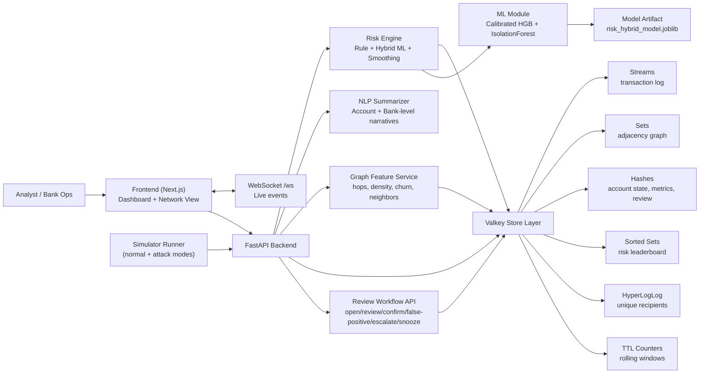
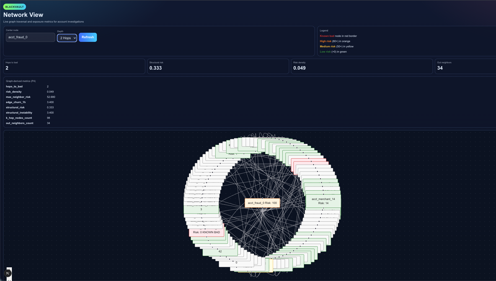
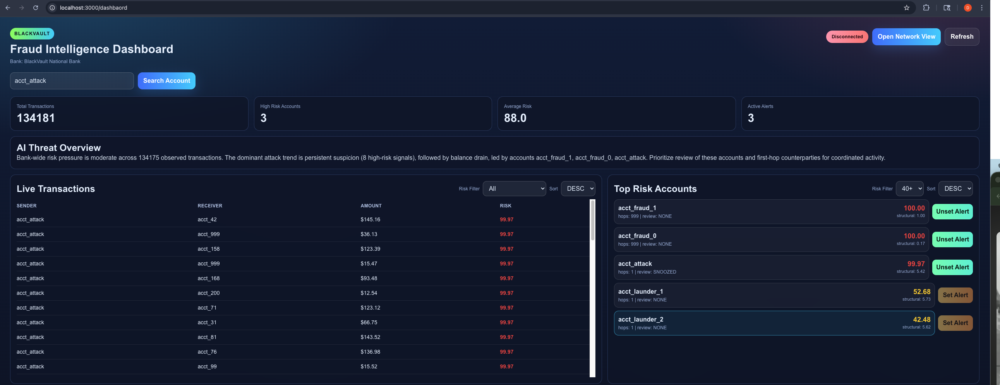
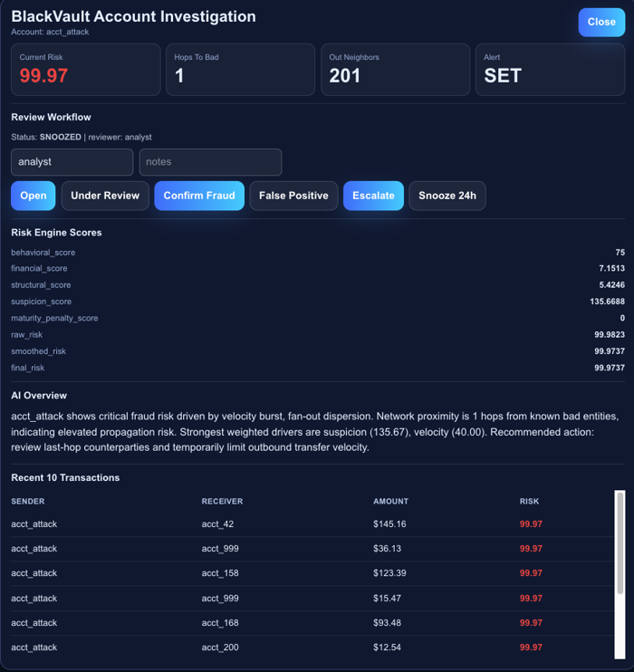

# BlackVault

BlackVault is a real-time fraud intelligence platform that combines:
- Valkey streams + graph storage
- Hybrid ML risk scoring (supervised + anomaly)
- Explainable NLP summaries for account-level and bank-level risk
- Live dashboard + network investigation UI

## Architecture

- `backend/`:
  FastAPI APIs, risk engine, Valkey feature store, NLP summarizer, graph metrics.
- `frontend/`:
  Next.js dashboard and network investigation view.
- `simulator_runner.py`:
  Transaction simulator to continuously generate traffic.

### System Diagram (Mermaid)



### Architecture PNG


## Prerequisites

- [Docker](https://docs.docker.com/get-docker/) + Docker Compose
- Node.js 18.17+ and npm 9+
- Python 3.11+ (for local model training script runs)

## Start backend + Valkey

```bash
docker compose up --build
```

Services:
- `valkey`: `localhost:6379`
- `backend` (FastAPI): `localhost:8000`

Docs:
- API docs: [http://localhost:8000/docs](http://localhost:8000/docs)
- OpenAPI: [http://localhost:8000/openapi.json](http://localhost:8000/openapi.json)

## Train and score ML model

BlackVault now uses a hybrid model artifact at:
- `backend/app/models/risk_hybrid_model.joblib`

Run training + evaluation locally:

```bash
python3 -m backend.app.ml.train_and_score
```

What this does:
- Trains calibrated `HistGradientBoostingClassifier` (supervised probability)
- Trains `IsolationForest` (novel anomaly probability)
- Blends both channels into `ml_probability`
- Prints score metrics (`roc_auc`, `f1`, `avg_precision`, etc.)
- Saves model artifact for runtime inference

Runtime behavior:
- If the model file is missing, backend auto-trains on startup and persists the artifact.

## Run frontend

```bash
cd frontend
npm install
NEXT_PUBLIC_API_BASE=http://localhost:8000 npm run dev
```

Open: [http://localhost:3000/dashboard](http://localhost:3000/dashboard)

Useful scripts:
- `npm run dev`
- `npm run build`
- `npm run start`
- `npm run lint`

## Run simulator

Use the simulator to generate continuous transactions and drive risk updates:

```bash
python3 simulator_runner.py
```

This feeds transactions to backend `/tx`, updates Valkey graph/feature keys, and drives:
- live transaction feed
- top risk accounts
- account investigation modal
- threat overview summaries

## Core APIs

- `POST /tx`
- `GET /tx/recent/enriched`
- `GET /risk/top/accounts`
- `GET /account/{account_id}`
- `POST /account/{account_id}/alert`
- `POST /account/{account_id}/review`
- `GET /account/{account_id}/review`
- `GET /graph/features?node={id}&k={k}`
- `GET /graph/neighborhood?node={id}&depth={d}`
- `GET /dashboard/bootstrap`
- `GET /dashboard/threat-summary`

## Screenshots

Add these files under `docs/images/`:
- `docs/images/network-view.png`
- `docs/images/account-investigation-1.png`
- `docs/images/account-investigation-2.png`

Then README renders:





## Notes

- Commit source files only. Generated artifacts like `__pycache__/` and `*.pyc` are ignored.
- If you change backend Python code while using Docker, rebuild the backend container:

```bash
docker compose up --build -d
```
